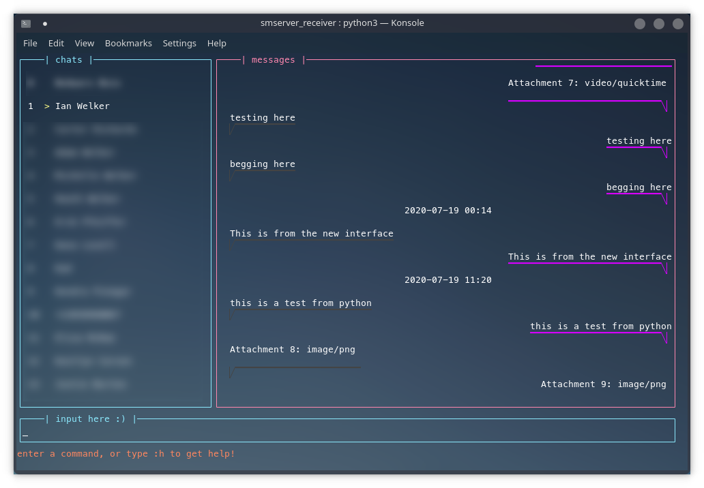

# Receiver app for SMServer

SMServer_receiver running on Konsole

Unnamed as of yet. Maybe I'll just keep it like this, idk. If you have a good name, let me know, 'cause I need one. 

### Requires:
 - python3
 - requests -- `pip3 install requests`
 - magic -- `pip3 install python-magic`
 - websocket-client -- `pip3 install websocket-client`
 - urllib3 -- `pip3 install urllib3`
 
The variables in lines 32 through 63 are the ones that would need to be changed for each inidividual's needs. The only one that you should need to set is 'ip', and the rest should be able to be left as they are preset, and allow everything to work perfectly. Look at the comment above each variable to see what it does, and whether or not you should bother changing it. 

To use this, you have to host a server with my [iPhone hosting app](https://github.com/iandwelker/smserver). It is now publicly available; read the README on the attached repo to install it manually or download it from [Twickd Repo](repo.twickd.com)

This mostly supports windows. Everything should work fine, except for persistence. On Mac & Linux, when changing a variable in-app, the script file is edited to set the new value, using `sed`. However, as Windows does not have coreutils (and I couldn't get this to work with vanilla python), it does not currently support persistent settings.

## To run

1. First, get a copy of the [iOS Version of SMServer](https://github.com/iandwelker/smserver) and start that running. 
2. Set your host device's private ip address in the 'ip' variable of the settings dictionary in main.py 
3. Navigate to the folder where main.py resides, and run `python3 ./main.py`, 

If you have issues with that, check to make sure that you've installed all of the above listed dependencies (just install them with pip3, e.g. `pip3 install curses`). If you're still having issues, continue to 'debugging' down below.

### Current features:
 - Sending texts & attachments
 - Viewing available conversations
 - View messages from any conversation
 - Easy viewing of image attachments outside of terminal
 - Nearly instantaneous dynamic loading of messages
 - Notifications when a new text is received
 - Extensive customization to run well on any system
 - Easy colorscheme customization
 - Starting new conversations
 - Websockets for instant communication

### Planned future features:
 - Displaying images with jp2a
 - Searching through existing conversations

## Debugging
- To debug, set 'debug' to True on line 63 of `main.py`
- Run the program again, and check what was the last thing to flash on the screen before the program either crashed or froze.
- Cross-reference the printed text with the code (find where in the code that command is printed), and try to fix it from there if you know python/curses. 
- If you don't want to mess with anything, submit an issue report on github with the last message that was printed, and what your settings array looks like. 

### Acknowledged Issues
- Messages with an attachment and no text have an extra blank line underneath them
- The program randomly completely spazzes out, replaces every box with random characters, and tries to print something to your printer?? This is absolutely baffling and I have no idea what is causing it.

## Settings variables:
**Any of these can be temporarily set without changing the script file by passing its name in with its value when calling the script. e.g. `python3 ./main.py --secure false` or `python3 ./main.py --colorscheme default`**

- `ip`: This contains the private IP of your host device, as a string. Should start with '192.168' or '10.10'. 
- `fallback`: This is the fallback device IP to try if the host device fails.
- `port`: This should default to 8741, and should be the port over which your host device communicates.
- `secure`: If you have SSL enabled on SMServer, set this to true. If you have SSL disabled, set this to false.
- `socket_port`: This is the port which the websocket will communicate on. The default should be 8740, keep that if you haven't chaned anything on the host device.
- `pass`: This contains the password to your server. It may need to be changed if you change the password to your main server.
- `req`: This should not be changed, unless you've messed with the source code of the smserver app. It's just the subdirectory of the main server where the requests will go.
- `chats_scroll_factor`: this is how many lines the chats box (on the far left) will scroll when you scroll up or down
- `messages_scroll_factor`: This is how many lines the messages box (on the right) will scroll when you scroll up or down.
- `current_chat_indicator`: The character that will sit by the side of the currently selected conversation.
- `my_chat_end`: The characters that will reside on the end of the underline of text messages from you. The length can be changed, but I wouldn't recommend making it too long, since it may look weird on short texts
- `their_chat_end`: Same as my_chat_end, but for texts to you.
- `chat_underline`: the character that will underline each text. Should only be one character, or things will be messed up. 
- `chat_vertical_offset`: This will the top inside padding for the chats box (the one on the far left)
- `title_offset`: The left padding of each of the box titles
- `x_title`: The title for $x box
- `colorscheme`: The colorscheme for the interface. Check the variable color_schemes for the available colorscheme. The comments in the variable give details on each number, and each number is a curses color code.
- `help_inset`: How much each help command description will be left-padded
- `ping_interval`: How frequently (in seconds) the program will ping the server to see if there are any new messages
- `poll_exit`: How frequently (in seconds) the program will check to see if you're trying to exit.
- `default_num_messages`: How many messages you want to load when you first select each conversation
- `default_num_chats`: How many conversations you want to load for the left chat box when you first launch the program
- `debug`: Makes everything really slow and flashes countless debug messages basically any time you do anything. Don't set to True unless you're actually debugging.
- `has_authenticated`: Sets to true once you authenticate with the server, so you don't authenticate every time you make a request.
